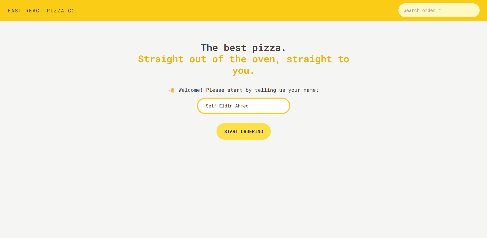
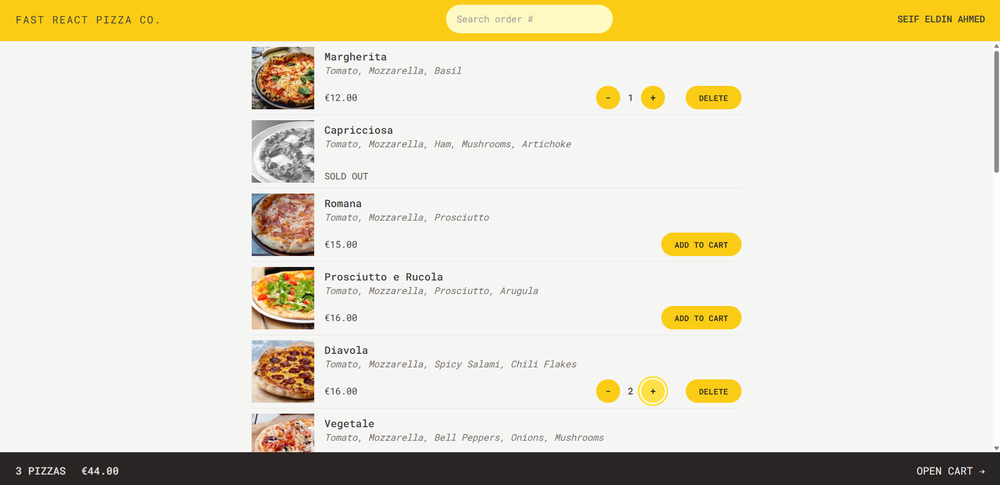
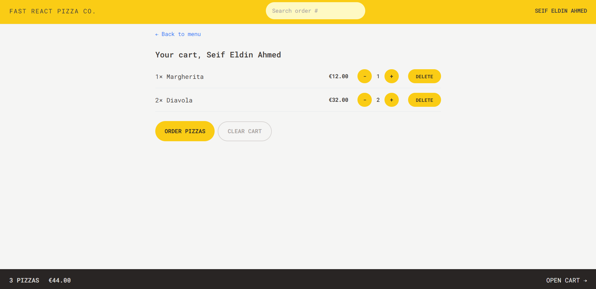
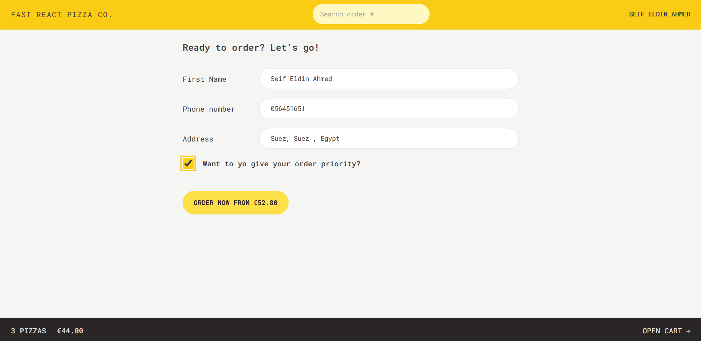
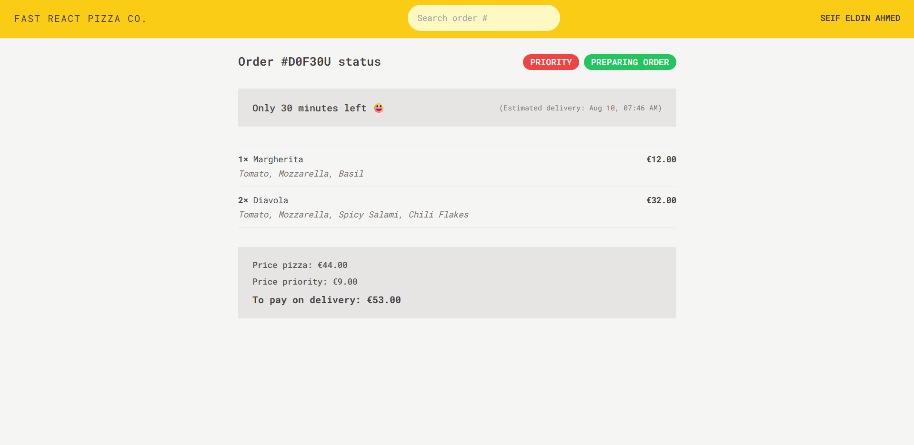

# 🍕 Fast React Pizza

A modern and responsive pizza ordering web application built with React and Vite.

The application allows customers to browse a wide variety of pizzas, add their favorite items to the cart, review their order, enter their personal and delivery information, and place their order seamlessly.

---

## 🚀 Live Demo

[View Live Demo](https://fast-react-pizza-v-app.vercel.app/)

---

## 📸 Preview

<!-- Add your project screenshot here -->







---

## ✨ Features

### 🍕 Pizza Menu

- Browse a wide variety of pizzas.
- View pizza ingredients and prices.
- Dynamically load menu items from an external API.
- Add pizzas to the shopping cart.
- Increase or decrease pizza quantities.

### 🛒 Shopping Cart

- View all selected pizzas.
- Display item quantities and prices.
- Update pizza quantities directly from the cart.
- Remove individual items from the cart.
- Display the total order price.
- Keep track of the number of items in the cart.

### 📦 Order Management

- Review the complete order before checkout.
- Enter customer information.
- Enter delivery address and contact information.
- Support priority orders.
- Submit and create orders through the API.
- Generate and use an order ID for order tracking.
- View order details after placing an order.

### 📍 Location & Delivery

- Use geocoding functionality to work with customer addresses.
- Retrieve location information from the provided address.
- Improve the ordering experience by automatically handling delivery location data.

### ⚡ User Experience

- Fast and responsive interface.
- Clean and modern UI.
- Responsive design for different screen sizes.
- Smooth navigation between application pages.
- Loading and error handling for API requests.
- Interactive UI components and feedback.

---

## 🛠️ Technologies & Libraries

### Frontend

- **React 18** — Component-based UI development.
- **Vite** — Fast development environment and build tool.
- **React Router DOM** — Client-side routing and navigation.
- **Redux** — Global state management.
- **Redux Toolkit** — Simplified and scalable Redux state management.

### Styling

- **Tailwind CSS** — Utility-first CSS framework.
- **PostCSS** — CSS processing.
- **Autoprefixer** — Automatic vendor prefixing for better browser compatibility.

### APIs & Services

- **Restaurant API** — Used to fetch pizza menu data and handle orders.
- **Geocoding API** — Used to retrieve location information from customer addresses.

### Development Tools

- **ESLint** — Code quality and consistency.
- **Prettier** — Code formatting.
- **Vite React Plugin** — React support and Fast Refresh during development.
- **TypeScript React Type Definitions** — React type support.

---

## 🏗️ Project Structure

```text
16-fast-react-pizza/
│
├── public/
│
├── src/
│   ├── features/
│   │   ├── cart/
│   │   ├── menu/
│   │   ├── order/
│   │   └── ...
│   │
│   ├── services/
│   │   ├── apiGeocoding.js
│   │   └── apiRestaurant.js
│   │
│   ├── ui/
│   │   └── Reusable UI Components
│   │
│   ├── utils/
│   │   └── Helper Functions
│   │
│   ├── App.jsx
│   ├── main.jsx
│   ├── index.css
│   └── store.js
│
├── .eslintrc.json
├── .gitignore
├── index.html
├── package.json
├── package-lock.json
├── postcss.config.js
├── prettier.config.cjs
├── tailwind.config.js
├── vite.config.js
└── README.md
```
